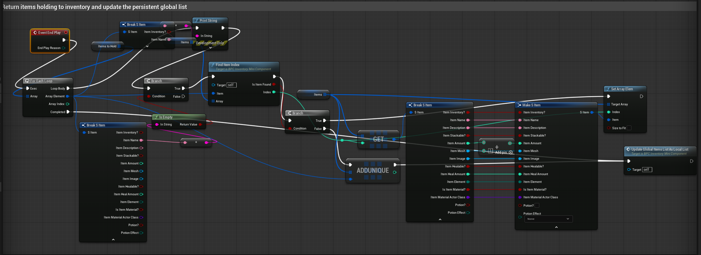

# IMGD 4000 – Development Portfolio

## My Role in the Project

My role in the project was primarily as a developer, and I also took on the role of IT support for the team. On the development side, I worked on core gameplay systems such as crafting, inventory persistence, interaction systems, and overall architecture decisions. On the IT side, I helped resolve build issues, Git problems, Unreal Engine version conflicts, and general project setup errors so other team members could continue developing without being blocked.

## High-level Project Architecture


---

## Challenges Faced

### General Challenges

One of the general challenges I faced was related to IT and version control. This included resolving Git merge conflicts and helping teammates fix C++ errors or project issues that prevented the project from opening. In one instance, a commit accidentally changed the project Unreal Engine version to 5.6.0, which broke everyone’s branches. I spent about an hour diagnosing why the project would not open and additional time helping each teammate fix their local setup so they could continue working.

Another general development challenge was my lack of prior experience with Unreal Engine 5. This affected early architectural decisions in the game code. In hindsight, there are areas where the architecture could have been cleaner, particularly around passing context between systems instead of relying on centralized managers earlier.

Collaboration between Blueprint and C++ code was another major challenge. While it is easy to expose C++ functionality to Blueprints, the reverse is not true. Blueprint logic cannot directly call into arbitrary C++ functions unless explicitly designed for it. Based on online sources, this is largely due to Unreal Engine’s design choices, but in practice it made collaboration difficult when some systems were implemented in Blueprints and others in C++. Connecting these systems and sharing types and functions was often unintuitive.

Live coding was another challenge. I initially relied on it heavily but later discovered that compiling without live coding was often more stable. Live coding would sometimes glitch and cause Blueprint types to break. For example, defining a struct called `Item` in C++ would sometimes generate an intermediate type such as `LIVECODING Item 0`, which would then break Blueprint graphs that depended on the original struct.

---

## How These Challenges Were Resolved

For IT-related issues, we designated one person, usually myself, to focus on resolving merge conflicts and build issues. This allowed other team members to stay productive and focus on development rather than troubleshooting environment problems.

To address the Blueprint and C++ collaboration issues, I adopted a pattern where C++ code that needed to interact with Blueprint logic would call virtual functions. These functions were then implemented in Blueprints. This allowed Blueprint-heavy systems to remain flexible while still being driven by C++ where needed.

Whenever live coding caused errors, my solution was to completely delete the `Saved`, `Intermediate`, and `Binaries` folders and recompile the project from scratch. While inconvenient, this consistently resolved type corruption and Blueprint issues caused by live coding.

---

## Specific Challenges: Crafting Scene

One of the main challenges was replicating the interaction flow of games like Surgeon Simulator. This raised questions about how grabbing, releasing, and item interaction should work in a 3D scene. Surgeon Simulator relies heavily on mouse-driven interaction, while our game also included an inventory system and a platforming scene. This made it unclear how to design a crafting view that was intuitive and useful for our gameplay.

Another challenge was managing inventory interactions within the crafting scene. When an item is taken out of the inventory, we needed a way to return it if the player did not end up using it. Tooltips were also necessary so players could understand what ingredients and cauldrons did without getting lost.

Inventory persistence was another issue. The inventory only existed in the platforming scene initially, so we needed a way to make it accessible in the crafting scene without duplicating data or logic.

---

## Overcoming Crafting Scene Challenges

To replicate the Surgeon Simulator style interaction, we switched from keyboard-based movement to mouse-based control. The player controller tracks the mouse location, which moves a “hand” actor in the scene. This hand actor has collision detection and is responsible for interacting with marked objects.

```cpp
void ACraftingPlayerController::UpdateHandPosition()
{
    if (!HandActor) return;

    float MouseX, MouseY;
    if (GetMousePosition(MouseX, MouseY))
    {
        FVector WorldOrigin, WorldDirection;
        DeprojectScreenPositionToWorld(MouseX, MouseY, WorldOrigin, WorldDirection);

        const float Distance = (HandZPlane - WorldOrigin.Z) / WorldDirection.Z;
        FVector NewLocation = WorldOrigin + (WorldDirection * Distance);

        HandActor->SetActorLocation(NewLocation);

        // Move camera
        // TODO: Consider moving this to another place that makes more sense
        // TODO: clamp the values of offset & add smoothing
        FVector camLoc = LevelCamera->GetActorLocation();
        
        FVector mouseLocation = FVector(MouseX, MouseY, 0.0f);
        FVector Offset = -(mouseLocation - LastMouseLocation) * 0.05f; 
        LevelCamera->SetActorLocation(camLoc + Offset);

        LastMouseLocation = mouseLocation;
    }
}

void ACraftingPlayerController::HandleBeginGrab()
{
    UE_LOG(LogTemp, Log, TEXT("Grab triggered"));
    HandActor->BeginGrab();
}
...
```

Grabbing occurs when the hand overlaps with a marked object. On mouse press, the object is lifted to visually indicate it is grabbed, physics simulation is disabled, and the object smoothly interpolates toward the mouse-controlled hand position. On release, physics is re-enabled. The hand actor handles casting collided actors into specific types such as cauldrons, potions, or ingredients, and triggers the appropriate logic for each.

```cpp
void ACraftHand::OnBeginOverlap(UPrimitiveComponent* OverlappedComp, AActor* OtherActor,
                                UPrimitiveComponent* OtherComp, int32 OtherBodyIndex,
                                bool bFromSweep, const FHitResult& SweepResult)
{
    UE_LOG(LogTemp, Warning, TEXT("Overlapping with: %s (Class: %s)"),
        *OtherActor->GetName(),
        *OtherActor->GetClass()->GetName());


    // If grabbing an object already --> do not execute overlap code
    if (GrabbedActor) return;
    
    OverlappingActors.AddUnique(OtherActor);

    UE_LOG(LogTemp, Warning, TEXT("Added overlap: %s"), *OtherActor->GetName());

    UpdateClosestActor();
}

void ACraftHand::UpdateClosestActor()
{
    float BestDistance = FLT_MAX;
    AActor* NewClosest = nullptr;

    FVector HandLocation = GetActorLocation();

    for (AActor* Actor : OverlappingActors)
    {
        if (!IsValid(Actor)) continue;

        float Dist = FVector::Dist(HandLocation, Actor->GetActorLocation());
        if (Dist < BestDistance)
        {
            BestDistance = Dist;
            NewClosest = Actor;
        }
    }

    if (NewClosest == nullptr)
    {
        UpdateTooltip(false, OverlappingActor);
        return;
    }

    // If closest changed, update highlight
    if (NewClosest != OverlappingActor)
    {
        // Remove highlight from old closest
        OverlappingActor = NewClosest;

        // Add highlight to new closest
    }
    UpdateTooltip(true, OverlappingActor);
}

void ACraftHand::BeginGrab()
{
    if (GrabbedActor) return;
    if (!OverlappingActor) return;
    
    UE_LOG(LogTemp, Warning, TEXT("Grabbing: %s (Class: %s)"),
        *OverlappingActor->GetName(),
        *OverlappingActor->GetClass()->GetName());
    
    // Special case: grab onto the pot
    if (ACauldronActor* Cauldron = Cast<ACauldronActor>(OverlappingActor))
    {
        UE_LOG(LogTemp, Warning, TEXT("This is a cauldron"));

        Cauldron->OnInteract();
        return;
    }
...
}

```

To manage unused inventory items, all items spawned from the inventory are stored in a temporary array called `hold`. When an item is used, such as being mixed into a potion, it is removed from this array. When the player exits the crafting scene or closes the game, all remaining items in `hold` are returned to the inventory.



Tooltips were implemented using a generalized interface called `TooltipProvider`. Any actor that implements this interface can provide tooltip text. When the hand actor collides with an actor that implements `TooltipProvider`, it retrieves the tooltip text and displays it at the user’s cursor.

```cpp
UINTERFACE(BlueprintType)
class UTooltipProvider : public UInterface
{
	GENERATED_BODY()
};

class ITooltipProvider
{
	GENERATED_BODY()

public:
	UFUNCTION(BlueprintNativeEvent, BlueprintCallable)
	FTooltipData GetTooltipData() const;
};

```

Inventory persistence was achieved by moving inventory data into the GameInstance. Both the platforming and crafting scenes load from the same inventory data array but display it using different UI layouts tailored to their respective gameplay needs.

---

## Crafting System Design

A key design goal was to create a generalized crafting system that non-coders could also use. Instead of hardcoding recipes in C++, all recipes are defined in a data asset. A mixing manager loads this data asset and uses it to output a general potion struct.

The mixing manager itself is loaded into the GameInstance, making it persistent across levels. Any system that needs to validate or create potions, including journaling, 2D crafting, or 3D crafting, can access the mixing manager through the GameInstance. This helped keep crafting logic centralized and reusable.

```cpp
class LOOMINESCENCE_API UPotionMixingManager : public UDataAsset
{
	GENERATED_BODY()

public:
	UPROPERTY(EditAnywhere, BlueprintReadWrite, Category = "Mixing")
	TArray<FMixRecipe> Recipes;

	UFUNCTION(BlueprintCallable, Category = "Mixing")
	FPotionData GetResult(EElementalType A, EElementalType B) const;

	UFUNCTION(BlueprintCallable, Category = "Mixing")
	FMixRecipe GetRecipe(EElementalType A, EElementalType B) const;
};

FPotionData UPotionMixingManager::GetResult(EElementalType A, EElementalType B) const
{
	FMixRecipe recipe = GetRecipe(A, B);
	return recipe.ResultPotion;
}

FMixRecipe UPotionMixingManager::GetRecipe(EElementalType A, EElementalType B) const
{
	UE_LOG(LogTemp, Warning, TEXT("This %hhd %hhd"), A, B);
	for (const FMixRecipe& Recipe : Recipes)
	{
		UE_LOG(LogTemp, Warning, TEXT("Recipe %hhd %hhd"), Recipe.ElementA, Recipe.ElementB);
		if ((Recipe.ElementA == A && Recipe.ElementB == B) ||
			(Recipe.ElementA == B && Recipe.ElementB == A))
		{
			return Recipe;
			
		}
	}
...
}
```

To solve issues with loading the mixing manager and its data, I used reflection to load a persistent instance in the GameInstance rather than trying to manually hook data assets in code. This ensured recipes were always available when needed.

```cpp
UPotionMixingManager* ULoomiUtils::GetMixingManager(UObject* WorldContext)
{
    UObject* GI = WorldContext->GetWorld()->GetGameInstance();

    // Reflection access for BP variable "MixingManager"
    FProperty* Prop = GI->GetClass()->FindPropertyByName(TEXT("MixingManager"));

    FObjectProperty* ObjProp = CastField<FObjectProperty>(Prop);

    UPotionMixingManager* Result =
        Cast<UPotionMixingManager>(ObjProp->GetObjectPropertyValue_InContainer(GI));

    return Result;
}
```
---

## Lessons Learned

Live coding is unreliable and should generally be avoided for larger projects. Centralizing systems that share responsibilities helps prevent the codebase from becoming difficult to manage. Communication with teammates is critical, especially when deciding whether systems should be implemented in C++ or Blueprints. Early decisions about what should be persistent and how systems should be modular make collaboration significantly easier.

---

## Version Control Experience

We used Git for version control, which introduced several challenges when working with Unreal Engine. Unreal Engine often locks files, so it is important to close the editor before changing branches or performing Git operations. Early on, I lost code because I did not do this.

Merging frequently, even when a feature is not fully complete, made integration much easier as long as the changes were modular and did not break the build. While Git worked, I would have preferred Perforce for this project. Perforce’s file locking system would have reduced merge conflicts and prevented unintended changes to important project files, such as the engine version file that caused major issues for the team.
